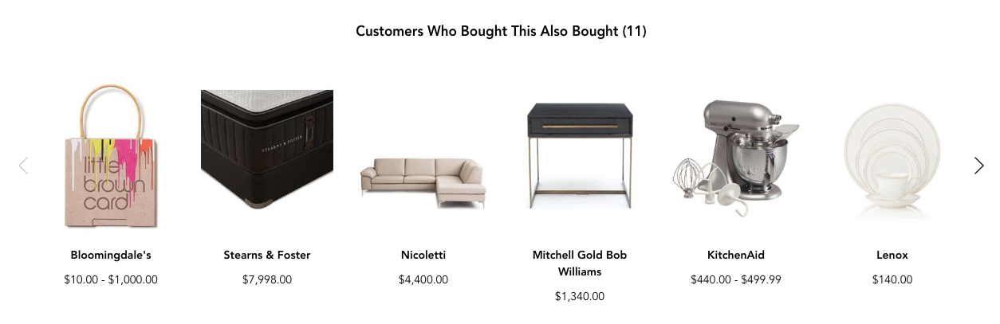
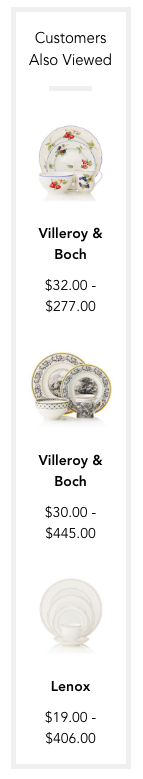

# PROs UI

## 3.0 Update
Added compatibility with BCOM CSG (@core/style-guide-bcom)

## Introduction

This feature fetches product recommendations based on context. The source of recommendations depends on the property flag `isRTOPROsEnabled`. If isRTOPROsEnabled is false, pros-ui will make a request to RichRelevance on the client side for recommendations. If isRTOPROsEnabled is true, pros-ui will make a request to the RTO API for recommendations.

Once the recommendations are returned, the feature will use [@feature/product-carousel-ui](https://code.devops.fds.com/polaris/feature/product-carousel-ui) to render the products in either a vertical container or horizontal carousel.

Notes:
- The feature is extended from Marionette.ItemView.
- Recommendation contexts are divided by page type (e.g. PDP, Bag, Search) and further divided by placement name (e.g. PDP: PDP_ZONE_A or PDP_ZONE_B).
- The feature will pass the appropriate analytics data to product-carousel-ui for the recommendationContext chosen, and will fire the corresponding Adobe Analytics tag when user clicks a thumbnail.
- The resultant destination urls for each rendered product are modified to include the appropriate zone for Coremetrics purposes. This modified url is meant to be used for the product view tag when user lands on the resultant PDP.

## Setup Instructions
- clone the repo
- cd into root
- run `npm install`
- `m build` (to build the project)
- to run the application:
  - bcom: `m server -e envconfigs/local/bcom/.env`
  - application is available at `http://localhost:8081`

## Methods

+ `initialize`:  
  @param {Object} Options
  - @param {string} recommendationContext - String representing the combination of page type with placement name to determine which type of recommendations to request. Use the class method #getRecommendationContexts to retrieve an object of all acceptable recommendationContexts

  - @params {object} recommendationConfig - Object containing data for the recommendations call. Required data varies depending on the recommendationContext (e.g. productId for PDP context and searchTerm for search results context)

  - @params {object} panelConfig - Object containing options for the product carousel ui to be rendered

    Example panelConfig Options
    - @params {boolean} [vertical = false] - true if the products should be displayed vertically (vertical products will not have carousel behavior)

    - @params {boolean} [disableAutoRenderCarousel = false] - Disable the product carousel from rendering immediately when render is called on the pros-ui instance. Useful in scenarios where one set of recommendations need to be rendered twice on a page (e.g. PDP_ZONE_A)

    - @params {string 'window' | 'slider' | 'min'} [respondTo = 'slider'] - The container with which responsive behavior of the carousel should be based off of. Refer to Slick Carousel documentation for additional details

      Additional options include any options accepted by [@feature/product-carousel-ui](https://code.devops.fds.com/polaris/feature/product-carousel-ui). Refer to its documentation for additional details. Default options set by pros-ui should be enough for most purposes.

  - @params {object} properties - Object containing flags, generally from DKS values at the page level

+ `onRender`: Original onRender method extended from Marionette.ItemView and called when #render method is called. Performs the following actions

  - Request recommendation data

    Skips below steps if `disableAutoRenderCarousel` is passed as true in panelConfig
  - Upon receipt of the list of recommended products, creates an instance of product-carousel-ui and sets it to the property, productCarouselView
  - Fetches product data for each of the recommended products via the instance of product-carousel-ui
  - Upon receipt of the individual product data, renders the product-carousel-ui

+ Class Method `getEventNames`: returns an object with properties for each event name that can be listened to on the instance.

+ Class Method `getRecommendationContexts`: returns an object with properties for each combination of page type with placement name.

+ Class Method `getAnalyticZones`: returns an object with properties for each analytic zone mapped to its recommendation context.

## Events

+ `productsRendered`: The product-carousel-ui instance is rendered

  For additional event names, refer to the documentation for [@feature/product-carousel-ui](https://code.devops.fds.com/polaris/feature/product-carousel-ui)

## Example
    const prosView = new PROsView({
      recommendationContext: PROsUI.getRecommendationContexts().pdpZoneA,
      recommendationConfig: {
        productId: '3048',
        categoryId: '3865',
        name: 'French Garden Fleurence Creamer',
      },
      panelConfig: {
        el: document.getElementById('pros-container'),
        vertical: true,
      },
      properties: {
        isRTOPROsEnabled: true,
      },
    });

    prosView.render();

    prosView.on(
      ProductCarouselUI.getEventNames().productsRendered,
      () => console.log('PROs products rendered')
    )

